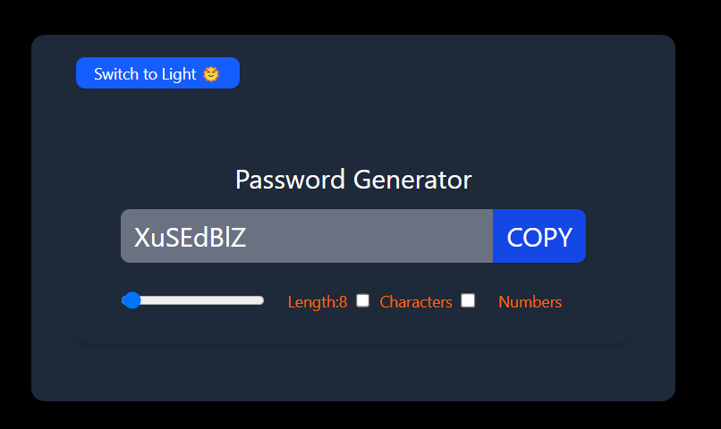

````markdown
🔐 Password Generator App

A responsive and modern Password Generator built with React and styled using Tailwind CSS.  
It includes smart features like clipboard copying with pop-up feedback, theme toggling (light/dark), and customization of password strength.

🚀 Features

🎨Theme Toggle: Switch between light and dark mode with a smooth toggle switch.
🔑Password Generator: Generate secure passwords of variable length with optional inclusion of:
  - Numbers (`0-9`)
  - Special characters (`!@#$%^&*()_+...`)
📋Copy to Clipboard: Click the COPY button to instantly copy the generated password.
✅Pop-up Notification: A floating "Copied to clipboard!" message appears for 2 seconds after copying.
⚛️React Hooks Used:
`useState`: Manages input states (password length, toggle states, copied flag, theme).
`useEffect`: Triggers password generation when inputs change.
`useCallback`: Optimizes password generation and clipboard copy logic.
`useRef`: Directly accesses the password input for clipboard operations.

📸 Screenshot



🧠 Hooks Summary

| Hook       | Purpose                                                                 |
|------------|-------------------------------------------------------------------------|
| `useState` | To hold and update UI data like password, length, toggle switches etc. |
| `useEffect`| Auto-generates password when dependencies (inputs) change.             |
| `useCallback`| Memoizes password generation and copy functions to avoid re-renders. |
| `useRef`   | Accesses the password input field for clipboard copying.               |

🛠️ Getting Started
````
 1. Clone the repo
```bash
git clone https://github.com/anisha0404/PasswordGeneratorwithThemeToggle.git
cd PasswordGeneratorWithThemeToggle
````

### 2. Install dependencies

```bash
npm install
```

### 3. Run the development server

```bash
npm run dev
```
